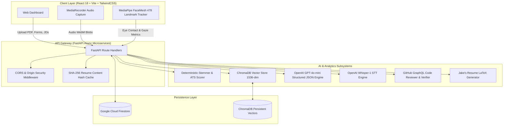

# 🎯 HireReady — Multi-Modal AI Placement Readiness & Evaluation Engine

<div align="center">

[](https://github.com/HarrisWarner04/HireReady/actions/workflows/ci.yml)
[](https://fastapi.tiangolo.com)
[](https://python.org)
[](https://platform.openai.com)
[](https://www.trychroma.com)
[](https://react.dev)
[](https://developers.google.com/mediapipe)
[](https://opensource.org/licenses/MIT)

**An end-to-end intelligent evaluation platform that benchmarks candidate job readiness through automated ATS resume parsing, vector-based semantic role matching, multi-modal AI mock interviews with computer vision proctoring, and deep GitHub codebase intelligence.**

[Key Features](#-key-features) • [System Architecture](#-system-architecture) • [AI Subsystems](#-ai-subsystems-deep-dive) • [PlaceScore™ Formula](#-placescore-composite-metric) • [API Reference](#-api-reference) • [Quick Start](#-quick-start)

</div>

---

## 📌 Executive Summary

Traditional tech campus placements and recruitment suffer from three critical bottlenecks:
1. **Opaque Resume Screening:** Black-box ATS parsers reject qualified candidates due to minor formatting anomalies without actionable feedback.
2. **Unverified Project Claims:** Resumes often inflate skills without verifiable codebase evidence.
3. **High-Anxiety, Inaccessible Mock Interviews:** High-quality 1-on-1 technical and behavioral interview practice is expensive and difficult to scale.

**HireReady** solves this by unifying **Resume Intelligence**, **GitHub Codebase AST Auditing**, and **Real-Time Interactive AI Mock Interviews** (vision + speech + adaptive LLM) into a single composite metric: **PlaceScore™**.

---

## 🚀 Key Features

- 📄 **Deterministic & Neural ATS Scoring**: 6-factor deterministic scoring breakdown (100 pts) combining algorithmic Porter-like suffix-stripping keyword extraction with dense semantic similarity against target Job Descriptions.
- 🧬 **ChromaDB Vector RAG Search**: 1,536-dimensional embeddings (`text-embedding-3-small`) index benchmark roles and compute real-time cosine similarity across candidate skill vectors.
- 🎙️ **Multi-Modal AI Mock Interviewer**:
  - **Speech-to-Text**: OpenAI Whisper STT with hallucination rejection heuristics.
  - **Vision Proctoring**: MediaPipe FaceLandmarker running real-time 478-point facial mesh tracking for gaze detection, eye-contact percentage, and head-pose attention tracking.
  - **Adaptive Question Engine**: 8 targeted interview questions dynamically generated from the candidate's resume, verified GitHub projects, and known target company interview patterns.
- 🐙 **GitHub Codebase Intelligence Engine**: GraphQL extraction across public repositories, auditing commit cadence, repo structure, test coverage presence, and cross-referencing claimed resume technologies against actual source code evidence.
- 📝 **Automated LaTeX Resume Engine**: Transforms parsed candidate data into a pristine Overleaf-compatible Jake's Resume LaTeX template, complete with instant `.tex` code downloads and ATS-safe plain text.
- 🏆 **Talent Leaderboard & Recruiter JD Matcher**: Public talent leaderboard with embedded vector search enabling recruiters to paste raw Job Descriptions and rank candidates via blended semantic match and PlaceScore™.

---

## 🏗️ System Architecture



---

## 🧠 AI Subsystems Deep Dive

### 1. Hybrid ATS Scoring Engine
Unlike naive LLM-only evaluators that suffer from non-deterministic grading variances, HireReady employs a **hybrid evaluation model**:

| Sub-Score Component | Weight | Implementation Methodology |
| :--- | :---: | :--- |
| **Keyword Match** | `25 pts` | Deterministic suffix-stripping stemmer with stop-word filtration against JD tokens |
| **Semantic Similarity** | `25 pts` | Cosine similarity: $\frac{\mathbf{u} \cdot \mathbf{v}}{\|\mathbf{u}\|_2 \|\mathbf{v}\|_2}$ via `text-embedding-3-small` vectors |
| **Format & Structure** | `20 pts` | Regex heuristics auditing contact fields, section hierarchy, length & typographical metrics |
| **Skills Coverage** | `15 pts` | Algorithmic set intersection over stemmed candidate vs target skill taxonomies |
| **Experience Relevance**| `10 pts` | Zero-temperature LLM evaluation grounded strictly on parsed responsibilities & tech stack |
| **Education Match** | `5 pts` | Degree & coursework relevance verification against role prerequisites |

$$\text{Total ATS Score} = \sum_{i=1}^{6} \text{SubScore}_i \quad (\text{Range: } 0 - 100)$$

---

### 2. Multi-Modal Mock Interview Engine

```
[Webcam Stream] ──> MediaPipe FaceLandmarker ──> Eye Contact % & Attention Loss Counter
[Microphone]   ──> WebM Audio Buffer         ──> Whisper-1 STT (w/ Hallucination Filter)
[Profile Data] ──> Resume + GitHub Context   ──> GPT-4o-mini Dynamic Interviewer
                                                        │
                                                        ▼
                                           8-Question Structured Rubric:
                                           • 2x Project-Specific
                                           • 1x GitHub Weakness / Unverified Skill
                                           • 2x Company Technical Patterns
                                           • 2x STAR Behavioral & Culture
                                           • 1x Career Goals & Company Fit
```

- **Whisper Hallucination Filter**: Audio silence or background noise often causes Whisper-1 to hallucinate phrases (*"Thank you for watching"*, *"Shabbat Shalom"*). HireReady implements a post-transcription filter that flags and prunes low-entropy hallucination signatures.
- **Contextual Rubric Evaluation**: Answers are scored across Technical Accuracy, Communication Clarity, and STAR methodology alignment, producing constructive feedback and automated follow-up probing questions.

---

### 3. Deep GitHub Codebase & Skill Verifier
1. Queries the GitHub GraphQL API for the candidate's top 8 public repositories, parsing file trees, topics, primary languages, commit recency, and README documentation.
2. Cross-references skills claimed on the resume (e.g., *Docker*, *FastAPI*, *Kubernetes*) against actual file extensions and import ASTs in the candidate's public repositories.
3. Generates **Interview Talking Points** and flags unverified skill claims to be targeted during the mock interview session.

---

## 📊 PlaceScore™ Composite Metric

HireReady ranks placement readiness through a weighted composite formula designed to reward well-rounded candidates:

$$\mathbf{PlaceScore} = (0.30 \times \text{ATS Score}) + (0.30 \times \text{GitHub Readiness}) + (0.40 \times \text{Interview Score})$$

### Recruiter JD Matching Mode
When recruiters query the talent pool with custom Job Descriptions, candidates are re-ranked using a blended vector similarity score:

$$\mathbf{Score}_{\text{blended}} = (0.60 \times \text{JD Cosine Match}) + (0.40 \times \mathbf{PlaceScore})$$

---

## 📡 API Reference

### Resume Intelligence
| Method | Endpoint | Description |
| :--- | :--- | :--- |
| `POST` | `/analyse-resume` | Multipart upload (PDF, company, job_title, uid). Runs complete extraction, ATS scoring, vector matching, and LaTeX generation. |
| `GET` | `/resume-history/{uid}` | Retrieves historical resume analyses for a given candidate. |
| `GET` | `/resume/{uid}/{resume_id}` | Fetches full analysis data for a specific resume submission. |
| `POST` | `/download-latex` | Returns downloadable `.tex` file generated using Jake's Resume format. |

### GitHub Intelligence
| Method | Endpoint | Description |
| :--- | :--- | :--- |
| `GET` | `/github/auth` | Generates GitHub OAuth authorization URL. |
| `GET` | `/github/callback` | Exchanges OAuth code for access token. |
| `POST` | `/github/sync` | Audits repositories, verifies claimed skills, and calculates GitHub readiness score. |
| `GET` | `/github/results/{uid}` | Retrieves stored GitHub codebase analysis. |

### AI Mock Interview
| Method | Endpoint | Description |
| :--- | :--- | :--- |
| `POST` | `/interview/transcribe` | Audio file transcription via OpenAI Whisper with hallucination filtering. |
| `POST` | `/interview/generate-questions`| Generates 8 personalized interview questions using Resume + GitHub context. |
| `POST` | `/interview/evaluate-answer` | Evaluates answer against ideal key points and rubric. |
| `POST` | `/interview/submit-session` | Submits complete session with eye contact metrics and generates comprehensive report. |
| `GET` | `/interview/sessions/{uid}` | Lists all completed interview sessions for candidate. |

### Analytics & Leaderboard
| Method | Endpoint | Description |
| :--- | :--- | :--- |
| `GET` | `/placescore/{uid}` | Calculates and returns breakdown of candidate PlaceScore™. |
| `GET` | `/leaderboard` | Returns top ranked candidates (supports company filters). |
| `POST` | `/leaderboard/match-jd` | Embeds recruiter Job Description and ranks candidate pool by blended match. |
| `POST` | `/recommendations` | Generates tailored role and company placement recommendations. |

---

## 📁 Repository Structure

```
HireReady/
├── .github/
│   └── workflows/
│       └── ci.yml                 # Automated CI test & build pipeline
├── backend/
│   ├── data/
│   │   └── job_roles.json         # Benchmark roles corpus for RAG vector search
│   ├── rag/
│   │   ├── embedder.py            # OpenAI embedding wrapper (1536-dim)
│   │   ├── seed.py                # ChromaDB vector collection seeder
│   │   └── setup.py               # Persistent ChromaDB client setup
│   ├── services/
│   │   ├── ats_scorer.py          # Deterministic stemmer & ATS scoring engine
│   │   ├── db_service.py          # Firebase Firestore persistence layer
│   │   ├── github_service.py      # GitHub GraphQL audit & skill verifier
│   │   ├── interview_service.py   # AI mock interviewer & rubric evaluator
│   │   ├── latex_generator.py     # Jake's Resume LaTeX compiler
│   │   ├── openai_client.py       # OpenAI GPT-4o-mini & Whisper client singleton
│   │   ├── pdf_extractor.py       # Robust PDF text extraction via pdfplumber
│   │   ├── resume_parser.py       # Structured JSON LLM resume extraction
│   │   ├── semantic_matcher.py    # Vector cosine similarity matching
│   │   └── suggestion_engine.py   # Actionable resume optimization engine
│   ├── tests/
│   │   ├── test_api.py            # API smoke & route validation tests
│   │   ├── test_ats_scorer.py     # Stemming, tokenization & ATS score unit tests
│   │   └── test_latex_generator.py# LaTeX escaping & template compilation tests
│   ├── .env.example               # Backend environment variable template
│   ├── main.py                    # FastAPI entrypoint & router
│   └── requirements.txt           # Python dependency specifications
├── frontend/
│   ├── src/
│   │   ├── components/            # UI components (ATSScoreCard, LaTeXPreview, etc.)
│   │   ├── pages/                 # Route views (Dashboard, Interview, Leaderboard, etc.)
│   │   ├── config.js              # API client configuration
│   │   └── firebase.js            # Firebase client initialization
│   ├── .env.example               # Frontend environment variable template
│   ├── package.json               # Frontend dependencies & scripts
│   └── vite.config.js             # Vite build & bundler configuration
├── LICENSE                        # MIT License
└── README.md                      # Project documentation
```

---

## ⚡ Quick Start

### Prerequisites
- **Python 3.11+**
- **Node.js 18+** & `npm`
- **OpenAI API Key** (for GPT-4o-mini, Whisper, and Embeddings)
- **Firebase Project** (Firestore & Auth)

---

### 1. Backend Setup

```bash
# Navigate to backend
cd backend

# Create & activate virtual environment
python -m venv venv
# On Windows:
.\venv\Scripts\activate
# On macOS/Linux:
source venv/bin/activate

# Install dependencies
pip install -r requirements.txt

# Configure environment variables
cp .env.example .env
```

Edit `backend/.env` with your API credentials:
```env
OPENAI_API_KEY=sk-proj-your-openai-key-here
FRONTEND_URL=http://localhost:5173
GITHUB_CLIENT_ID=your-github-oauth-client-id       # Optional
GITHUB_CLIENT_SECRET=your-github-oauth-secret      # Optional
GITHUB_REDIRECT_URI=http://localhost:8000/github/callback
```

Seed the ChromaDB vector database (optional — auto-seeds on first startup):
```bash
python -m rag.seed
```

Run the backend server:
```bash
python main.py
# Server runs at http://localhost:8000
# Interactive OpenAPI Docs available at http://localhost:8000/docs
```

---

### 2. Frontend Setup

```bash
# Navigate to frontend
cd ../frontend

# Install dependencies
npm install

# Configure environment variables
cp .env.example .env
```

Edit `frontend/.env`:
```env
VITE_API_URL=http://localhost:8000
VITE_FIREBASE_API_KEY=your-firebase-api-key
VITE_FIREBASE_AUTH_DOMAIN=your-project.firebaseapp.com
VITE_FIREBASE_PROJECT_ID=your-project-id
VITE_FIREBASE_STORAGE_BUCKET=your-project.appspot.com
VITE_FIREBASE_MESSAGING_SENDER_ID=your-sender-id
VITE_FIREBASE_APP_ID=your-app-id
```

Start the frontend development server:
```bash
npm run dev
# Application opens at http://localhost:5173
```

---

## 🧪 Testing & Quality Assurance

Run the automated backend test suite:
```bash
cd backend
python -m unittest discover -s tests -p "test_*.py" -v
```

Verify frontend production build:
```bash
cd frontend
npm run build
```

---

## 🛠️ Engineering Decisions & Trade-offs

- **Deterministic Keyword Matching vs Pure LLM Extraction**:
  *Trade-off*: Pure LLMs provide flexible phrasing but introduce temperature-induced score variances between runs on identical resumes.
  *Decision*: We designed a deterministic, Porter-stemmer-inspired suffix stripping algorithm for keyword matching and regex format scoring, reserving LLMs for semantic contextualization and structural parsing. This guarantees consistent, reproducible scores for the same candidate.
- **Client-Side MediaPipe FaceLandmarker vs Video Streaming**:
  *Trade-off*: Sending raw webcam video frames to a backend for facial tracking creates high bandwidth overhead and latency.
  *Decision*: MediaPipe runs client-side in WebAssembly/WebGL inside the browser, calculating 478 face landmarks at 30 FPS locally and only transmitting aggregated gaze/attention metrics to the API.
- **Whisper STT with Silence Hallucination Filtering**:
  *Trade-off*: Browser Web Speech API suffers from inconsistent cross-browser compatibility and inaccurate technical terminology recognition.
  *Decision*: We route recorded audio blobs to OpenAI Whisper-1 with a tailored technical vocabulary prompt and apply a post-processing filter to eliminate low-entropy noise hallucinations.

---

## 📄 License

This project is licensed under the [MIT License](LICENSE).

---

<div align="center">
  <sub>Built with ❤️ for engineers preparing for their dream roles.</sub>
</div>
